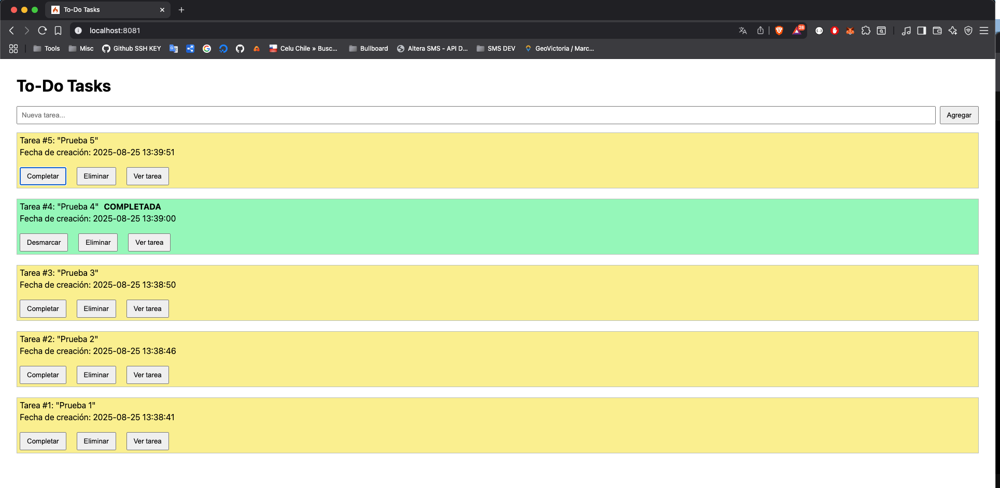
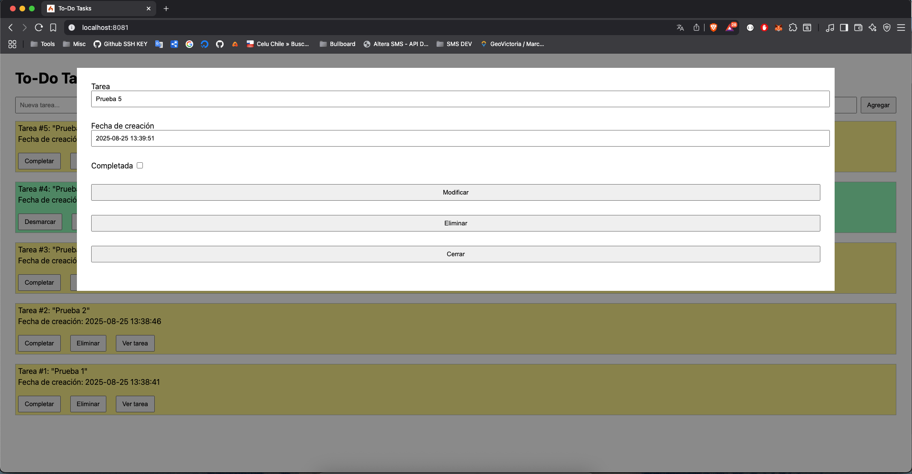

# SRN Task Test

Este repositorio contiene la implementación del TO DO que se pide en el test

## Instalación

### Clonación repositorio

Se debe clonar el repositorio BgonzalezJ/SRN-task-test.git

```bash 
$ git@github.com:BgonzalezJ/SRN-task-test.git SRN-task-test
$ cd SRN-task-test
```

### Levantar proyecto con docker

El proyecto cuenta con un Dockerfile y un docker-compose.yml que contiene lo necesario para levantar el proyecto (PHP 8, DB Mysql, nginx)

```bash 
$ docker compose build
$ docker compose up -d
```

### Configuración .env

Se debe copiar el archivo .env.example y reemplazar los valores en caso de ser necesario. Para el efecto del test dentro del .env.example ya vienen los valores de la base de datos.

### Migración de tabla tasks

Se debe ejecutar php spark migrate dentro del contenedor de Docker

```bash 
$ docker compose exec app php spark migrate  
```

## Uso de la plataforma

Para acceder a la plataforma se debe ingresar a la url http://localhost:8081 (puerto definido en el archivo docker-compose.yml).

### Agregar tareas

Para agregar tareas se debe escribir la tarea en el campo de texto y hacer click en el botón "Agregar"

### Modificar tareas

Para modificar una tarea (tanto el nombre como si estado de completado) se debe hacer click en el botón "Ver tarea". Esto levantará un modal con la información correspondiente y se podrá modificar el nombre junto con su estado y se guardarán los cambios al hacer click en el botón "Modificar".

### Completar tareas
Además de poder completar las tareas dentro del modal también se puede realizar esta acción en la lista de tareas haciendo click en el botón "Completar". También se puede desmarcar como completado haciendo click en el mismo botón o modificando la información de la tarea dentro del modal.

### Eliminar tareas
Se pueden eliminar tareas dentro del modal haciendo click en el botón "Eliminar" y también se puede realizar esta acción haciendo click en el botón "Eliminar" en la lista de tareas.





## Endpoints

| Endpoint         | Método | Campos a enviar (body)                     | Headers              | Respuestas posibles |
|-----------------|--------|-------------------------------------------|--------------------|-------------------|
| /tasks          | GET    | -                                         | Content-Type: application/json | 200 OK → ` [ { "id": 1, "title": "Mi tarea", "completed": false, "date": "25-08-2025 00:00:00" } ]` |
| /tasks/{id}     | GET    | -                                         | Content-Type: application/json | 200 OK → `{ "data": { "id": 1, "title": "Mi tarea", "completed": false, "date": "25-08-2025 00:00:00" } }`<br>404 Not Found → `{ "error": "Ocurrió un error" }` |
| /tasks          | POST   | `task` (string, obligatorio)             | Content-Type: application/json | 201 Created → `{ "data": { "id": 1, "title": "Mi tarea", "completed": false, "date": "25-08-2025 00:00:00" } }`<br>409 Conflict → `{ "error": "Ocurrió un error" }`<br>422 Unprocessable Content → `{ "error": "Faltan datos" }` |
| /tasks/{id}     | PUT    | `task` (string, opcional)<br>`completed` (boolean, opcional) | Content-Type: application/json | 200 OK → `{ "data": { "id": 1, "title": "Mi tarea actualizada", "completed": true, "date": "25-08-2025 00:00:00" } }`<br>404 Not Found → `{ "error": "Ocurrió un error" }`<br>409 Conflict → `{ "error": "Ocurrió un error" }`<br>422 Unprocessable Content → `{ "error": "Faltan datos" }` |
| /tasks/{id}     | DELETE | -                                         | Content-Type: application/json | 200 OK → `{ "data": { "delete": true } }`<br>404 Not Found → `{ "error": "Ocurrió un error" }` |

Los mensajes de error para la documentación son genéricos. Los endpoints pueden responder los siguientes errores:

- No se enviaron datos
- Ya existe una tarea con ese título
- Error al guardar la tarea
- Tarea no existe
- No se pudo actualizar la tarea
- Error al guardar la tarea
- La tarea debe tener al menos 3 carácteres (máximo 255)
- El campo completed debe ser de tipo boolean

## Test

Para ejecutar el test se deben realizar los siguientes pasos:

- Copiar el archivo phpunit.xml.dist a phpunit.xml. Este archivo ya viene listo con los valores para probar.
- Ejecutar el comando ./vendor/bin/phpunit.

```bash 
$ docker compose exec app ./vendor/bin/phpunit tests/TasksControllerTest.php
```

Los tests son los siguientes:

- Crear una tarea correctamente
- Error al crear una tarea duplicada
- Buscar una tarea que no existe
